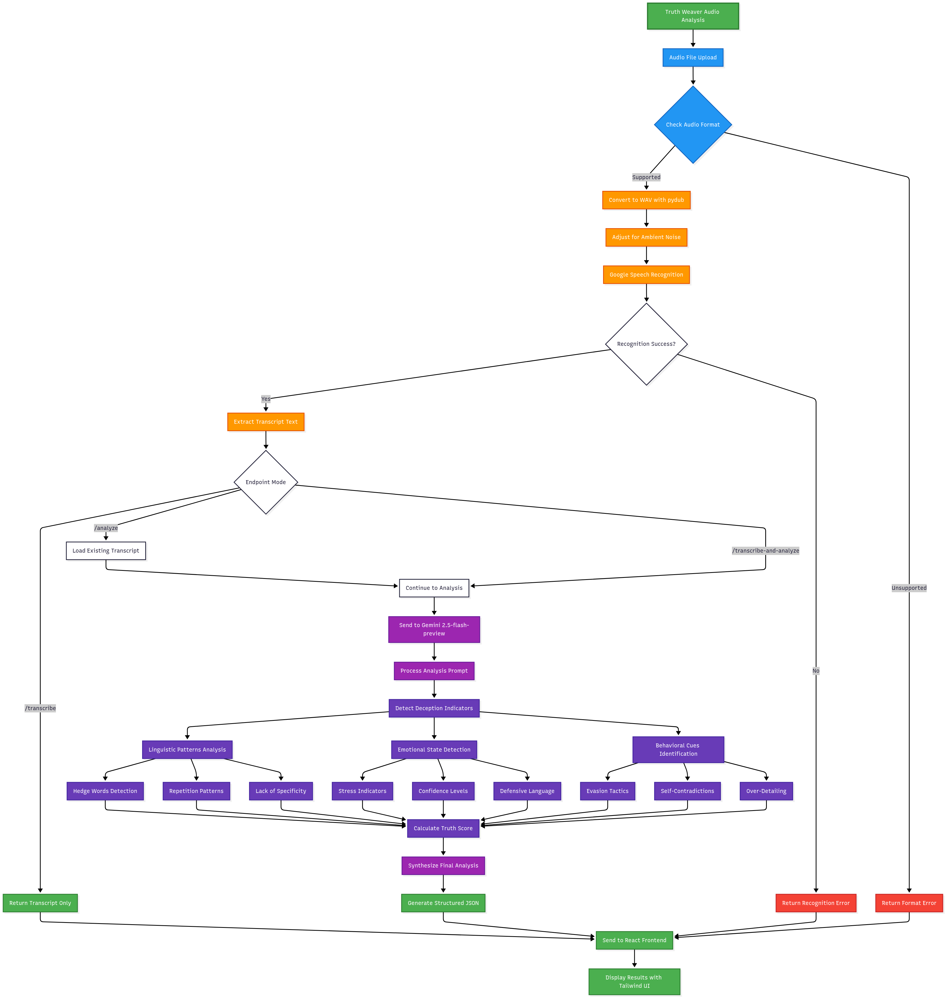

# Truth Weaver: AI-Powered Transcript & Deception Analysis

<div align="center">
  
</div>

<div align="center">


**An AI-powered system that analyzes human communication patterns to detect deception and reveal hidden truths.**

[](https://python.org)
[](https://reactjs.org)
[](https://flask.palletsprojects.com)
[](https://docker.com)

</div>

## 🎯 Overview

Truth Weaver is an innovative system designed for the **Innov8 3.0 hackathon** that analyzes audio recordings of "Whispering Shadow" agents' testimonies. It uses advanced AI to identify inconsistencies, contradictions, and deception patterns in human speech, then synthesizes the most likely truth from conflicting claims.
</div>

🌐 **Live Demo:** [truth-weaver.vercel.app](https://truth-weaver.vercel.app/)

## ✨ Features

 - 🎤 **Audio Transcription**: Convert audio files to text using OpenAI Whisper (batch/offline) or via API
- 🔍 **Pattern Recognition**: Identifies self-corrections, evasions, and contradictory claims
- 📊 **Structured Output**: Generates detailed JSON reports with revealed truths and deception patterns
 - **Google Gemini API** for advanced AI analysis
 - **OpenAI Whisper** for audio transcription (batch/offline)
- 🔄 **Real-time Processing**: Live audio upload and analysis

## 🏗️ Architecture

```
Truth Weaver/
├── frontend/          # React + Vite + Tailwind CSS
│   ├── src/
│   │   ├── App.jsx    # Main application component
│   │   └── index.css  # Tailwind CSS imports
│   └── package.json
├── backend/           # Flask API + AI Analysis
│   ├── app.py         # Main Flask application
│   ├── truth_weaver_module.py  # Gemini AI integration
│   └── Dockerfile     # Container configuration
├── analysis/               # Original analysis scripts
│   ├── truth_weaver.py
    ├── transcriber.py
    ├── /audio
    ├── /json
    ├── /transcript
│   └── sample transcripts
└── Bonus_Challenge/   
│   ├── detailed_truth_weaver_flow.mmd
    ├── Mermaid Chart.png
```


## 🚀 Quick Start

### Local Batch Usage (Recommended for Hackathon)

1. Place your audio files (e.g., `interview1.wav`, `interview2.mp3`, etc.) in the `analysis/audio/` directory. Multiple common audio formats are supported.
2. Set your Gemini API key in `analysis/truth_weaver.py` (the key is now hardcoded for hackathon demo):
  ```python
  GEMINI_API_KEY = "YOUR_GEMINI_API_KEY" 
  ```
3. (Optional) Set the Whisper model name and combined transcript filename as constants in the script if needed.
4. Run the transcription script:
  ```
  python analysis/transcriber.py
  ```
5. Run the analysis script:
  ```
  python analysis/truth_weaver.py
  ```
6. Find transcript `.txt` files in `analysis/transcript/` and output `.json` files in `analysis/json/`.
```
/analysis
  /audio         # Input audio files (.wav, .mp3, .m4a, etc.)
  /transcript    # Output transcript files (.txt)
  /json          # Output JSON analysis files
  transcriber.py # Audio-to-text script
  truth_weaver.py# Transcript analysis script
```

### Prerequisites

- **Python 3.9+**
- **Node.js 16+**
- **Docker** (optional)
- **Gemini API Key** (required)

### 1. Clone the Repository

```bash
git clone https://github.com/sneha752/truth-weaver-project.git
cd truth-weaver-project
```

### 2. Setup Backend

#### Option A: Local Development
```bash
cd backend
pip install -r requirements.txt

# Edit truth_weaver_module.py and add your Gemini API key
# api_key = "YOUR_GEMINI_API_KEY"

python app.py
```

#### Option B: Docker (Recommended)
```bash
cd backend
docker build -t truth-weaver-backend .
docker run -d -p 5000:5000 --name truth-weaver truth-weaver-backend
```

### 3. Setup Frontend

```bash
cd frontend
npm install
npm run dev
```

### 4. Access the Application

- **Frontend**: http://localhost:5173
- **Backend API**: http://localhost:5000
- **Health Check**: http://localhost:5000/health

## 📋 API Endpoints

### Health Check
```
GET /health
```
Returns server status and confirms the backend is running.

### Transcribe Audio
```
POST /transcribe
Content-Type: multipart/form-data
Body: audio file (key: 'audio')
```
Converts audio files to text transcript.

### Analyze Transcript
```
POST /analyze
Content-Type: application/json
Body: {"transcript": "text", "filename": "optional"}
```
Analyzes transcript for deception patterns using Gemini AI.

### Combined Processing
```
POST /transcribe-and-analyze
Content-Type: multipart/form-data
Body: audio file (key: 'audio')
```
One-step process: transcribe audio and analyze in a single request.

## 🎵 Supported Audio Formats

- ✅ **WAV** (recommended)
- ✅ **MP3**
- ✅ **MP4/M4A**
- ✅ **FLAC**
- ✅ **OGG**
- ✅ **WEBM**

## 🧠 How It Works

### 1. Audio Processing
- Converts audio to optimal format (mono, 16kHz)
- Normalizes volume and removes noise
- Uses Google Speech Recognition for transcription

### 2. AI Analysis
- Sends transcript to Google Gemini API
- Analyzes for contradictions and deception patterns
- Identifies key claims about programming experience, skills, leadership

### 3. Truth Synthesis
- Reconciles conflicting statements
- Generates "revealed truth" summary
- Categorizes types of deception found

### 4. Structured Output
```json
{
  "shadow_id": "agent_identifier",
  "revealed_truth": {
    "programming_experience": "3-4 years actual experience",
    "programming_language": "Python, JavaScript",
    "skill_mastery": "Intermediate",
    "leadership_claims": "Coordinator, not leader",
    "team_experience": "Individual contributor",
    "skills and other keywords": ["debugging", "testing"]
  },
  "deception_patterns": [
    {
      "lie_type": "experience_inflation",
      "contradictory_claims": [
        "Initially claimed 6 years experience",
        "Later corrected to 3 years full-time"
      ]
    }
  ]
}
```

## 🔧 Configuration

### Environment Variables

```bash
# Backend
FLASK_ENV=production
FLASK_APP=app.py
GEMINI_API_KEY=your_api_key_here

# Frontend
VITE_API_URL=http://localhost:5000
```

### Gemini API Setup

1. Get your API key from [Google AI Studio](https://makersuite.google.com/app/apikey)
2. Edit `backend/truth_weaver_module.py`:
   ```python
   api_key = "YOUR_GEMINI_API_KEY"
   ```

## 🐳 Docker Deployment

### Build and Run
```bash
# Backend
cd backend
docker build -t truth-weaver-backend .
docker run -d -p 5000:5000 --name truth-weaver truth-weaver-backend

# Frontend (if containerizing)
cd frontend
docker build -t truth-weaver-frontend .
docker run -d -p 3000:3000 --name truth-weaver-ui truth-weaver-frontend
```

### Docker Management
```bash
# View logs
docker logs truth-weaver

# Stop container
docker stop truth-weaver

# Remove container
docker rm truth-weaver

# Restart container
docker restart truth-weaver
```

## 🧪 Testing

### Manual Testing
1. Start both backend and frontend
2. Upload a `.wav` audio file with speech
3. Verify transcription appears
4. Check AI analysis results


## 🛠️ Development

### Backend Development
```bash
cd backend
pip install -r requirements.txt
python app.py  # Runs on http://localhost:5000
```

### Frontend Development
```bash
cd frontend
npm install
npm run dev  # Runs on http://localhost:5173
```

### Making Changes
- Backend: Modify `app.py` or `truth_weaver_module.py`
- Frontend: Edit components in `src/`
- Styling: Use Tailwind CSS classes in JSX


## 🎨 UI Features

- **Modern Design**: Clean, professional interface using Tailwind CSS
- **File Upload**: Drag-and-drop or click to upload audio files
- **Real-time Feedback**: Loading states and progress indicators
- **Results Display**: Structured presentation of transcripts and analysis
- **Responsive**: Works on desktop and mobile devices
- **Error Handling**: Clear error messages and troubleshooting tips

## 🚨 Troubleshooting

### Common Issues

**Backend not starting:**
```bash
# Check if port 5000 is in use
lsof -i :5000
# Kill process if needed
kill -9 <PID>
```

**Audio processing errors:**
- Ensure audio file contains clear speech
- Check internet connection for Google Speech Recognition
- Verify FLAC codec is installed (included in Docker)

**Frontend not connecting to backend:**
- Verify backend is running on port 5000
- Check CORS configuration in `app.py`
- Ensure no firewall blocking connections

### Debug Mode
```bash
# Backend debug mode
FLASK_ENV=development python app.py

# View Docker logs
docker logs truth-weaver
```

## 🤝 Contributing

1. Fork the repository
2. Create a feature branch: `git checkout -b feature-name`
3. Commit changes: `git commit -am 'Add feature'`
4. Push to branch: `git push origin feature-name`
5. Submit a pull request

## 📄 License

This project is licensed under the MIT License - see the [LICENSE](LICENSE) file for details.

## 🏆 Hackathon Context

Developed for **Innov8 3.0 hackathon** with the theme of analyzing "Whispering Shadow" agent testimonies. The system is designed to be a detective tool that can uncover hidden truths and identify deception patterns in human communication.

## 🙏 Acknowledgments

- **Google Gemini API** for advanced AI analysis
- **Google Speech Recognition** for audio transcription
- **React** and **Tailwind CSS** for the modern frontend
- **Flask** for the lightweight backend API
- **Docker** for containerization

---

<div align="center">

**Built with ❤️ for Innov8 3.0 hackathon**

[Report Bug](https://github.com/sneha752/truth-weaver-project/issues) · [Request Feature](https://github.com/sneha752/truth-weaver-project/issues) · [Documentation](https://github.com/sneha752/truth-weaver-project/wiki)

</div>